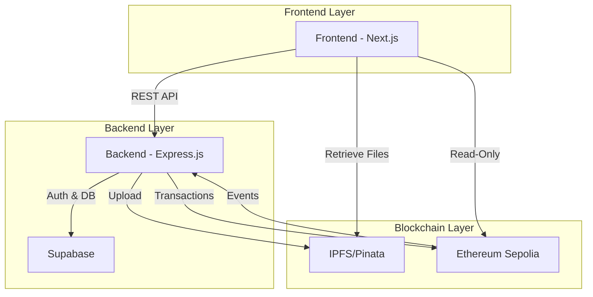

# ConfCert - Blockchain Certificate Management System

<div align="center">


**A decentralized, blockchain-based certificate issuance and verification platform**

[](https://nextjs.org/)
[](https://reactjs.org/)
[](https://nodejs.org/)
[](https://ethereum.org/)
[](LICENSE)

[Features](#features) • [Architecture](#architecture) • [Quick Start](#quick-start) • [Documentation](#documentation) • [Demo](#demo)

</div>

---

## 📋 Table of Contents

- [Overview](#overview)
- [Features](#features)
- [Architecture](#architecture)
- [Technology Stack](#technology-stack)
- [Project Structure](#project-structure)
- [Quick Start](#quick-start)
- [Documentation](#documentation)
- [Usage Guide](#usage-guide)
- [Smart Contract](#smart-contract)
- [Security](#security)
- [Contributing](#contributing)
- [License](#license)

---

## 🌟 Overview

**ConfCert** is a comprehensive blockchain-based certificate management system designed for educational institutions and organizations. It leverages Ethereum blockchain for immutable certificate storage, IPFS for decentralized file storage, and modern web technologies for a seamless user experience.

### Why ConfCert?

- **🔒 Immutable**: Certificates stored on blockchain cannot be altered or forged
- **🌐 Decentralized**: IPFS ensures certificate files are always accessible
- **✅ Verifiable**: Anyone can verify certificate authenticity instantly
- **📧 Automated**: Email notifications with blockchain verification links
- **🎨 Customizable**: Built-in certificate editor with templates
- **📊 Scalable**: Bulk issuance for handling multiple certificates at once

---

## ✨ Features

### 🎓 **For Students**
- ✅ Register with institutional email
- ✅ Email verification for security
- ✅ View all received certificates
- ✅ Download certificates as PDF
- ✅ Share verification links
- ✅ No wallet or crypto knowledge required

### 👨‍💼 **For Club Admins**
- ✅ Issue certificates for club events
- ✅ Custom certificate templates
- ✅ Bulk certificate issuance via Excel
- ✅ Track issued certificates
- ✅ Email notifications to recipients
- ✅ Real-time blockchain confirmation

### 🔐 **For Administrators**
- ✅ Complete user management
- ✅ Create and manage club admins
- ✅ Blockchain admin management
- ✅ System statistics dashboard
- ✅ Wallet balance monitoring
- ✅ Contract address management

### 🌍 **Public Features**
- ✅ Certificate verification without login
- ✅ Search by certificate ID
- ✅ View complete certificate details
- ✅ Blockchain transaction verification
- ✅ IPFS file retrieval with fallback gateways

---

## 🏗️ Architecture



### System Components

1. **Frontend (Next.js 16 + React 19)**
   - Server-side rendering for SEO
   - App Router for modern routing
   - Responsive UI with Tailwind CSS
   - Real-time updates with React hooks
   - Web3 read-only integration

2. **Backend (Node.js + Express)**
   - RESTful API architecture
   - JWT authentication
   - Role-based access control
   - File upload handling (Multer)
   - Email service (Nodemailer + Zoho)
   - Blockchain transaction management

3. **Database (Supabase)**
   - PostgreSQL database
   - Authentication service
   - Real-time subscriptions
   - Row-level security

4. **Blockchain (Ethereum)**
   - Smart contract on Sepolia testnet
   - Immutable certificate registry
   - Event emission for tracking
   - Gas-optimized operations

5. **Storage (IPFS/Pinata)**
   - Decentralized file storage
   - Certificate image hosting
   - Multiple gateway fallbacks
   - Permanent file pinning

---

## 🛠️ Technology Stack

### Frontend
| Technology | Version | Purpose |
|------------|---------|---------|
| Next.js | 16.1.1 | React framework with SSR |
| React | 19.2.3 | UI library |
| Tailwind CSS | 4.0 | Styling framework |
| ethers.js | 6.16.0 | Blockchain interaction |
| axios | 1.13.2 | HTTP client |
| framer-motion | 12.23.26 | Animations |
| Supabase Client | 2.90.1 | Auth & database client |

### Backend
| Technology | Version | Purpose |
|------------|---------|---------|
| Node.js | 18+ | Runtime environment |
| Express.js | 4.x | Web framework |
| ethers.js | 6.x | Blockchain SDK |
| Supabase | 2.x | Database & auth |
| Multer | 1.x | File uploads |
| Nodemailer | 7.x | Email service |
| Pinata | Latest | IPFS service |

### Blockchain
| Technology | Purpose |
|------------|---------|
| Solidity | Smart contract language |
| Ethereum Sepolia | Test network |
| Hardhat/Remix | Development tools |

### DevOps
- **Version Control**: Git & GitHub
- **Deployment**: Vercel (Frontend), VPS/Cloud (Backend)
- **CI/CD**: GitHub Actions (optional)
- **Monitoring**: Etherscan, Supabase Dashboard

---

## 📁 Project Structure

```
confcert-vitap/
├── frontend/                    # Next.js frontend application
│   ├── app/                    # Next.js 16 App Router
│   │   ├── layout.js          # Root layout
│   │   ├── page.js            # Landing page
│   │   ├── about/             # About page
│   │   ├── admin/             # Admin dashboard
│   │   ├── club-admin/        # Club admin dashboard
│   │   ├── create/            # Certificate creation
│   │   ├── edit-template/     # Template editor
│   │   ├── login/             # Authentication
│   │   ├── profile/           # User profile
│   │   ├── register/          # Student registration
│   │   └── verify/            # Certificate verification
│   ├── components/            # Reusable React components
│   │   ├── ui/               # UI component library
│   │   ├── AuthGuard.jsx     # Route protection
│   │   ├── GuestGuard.jsx    # Guest route protection
│   │   └── CertificateEditor.jsx # Certificate editor
│   ├── contexts/             # React contexts
│   │   └── AuthContext.js    # Authentication context
│   ├── lib/                  # Utility libraries
│   │   ├── axiosClient.js   # Configured axios
│   │   ├── web3.js          # Web3 utilities
│   │   ├── certificate-api.js # Certificate API
│   │   ├── ipfs.js          # IPFS utilities
│   │   └── supabase.js      # Supabase client
│   ├── public/              # Static assets
│   └── package.json         # Dependencies
│
├── backend/                     # Express.js backend
│   ├── src/
│   │   ├── server.js         # Entry point
│   │   ├── config/           # Configuration files
│   │   │   ├── email.config.js
│   │   │   └── env.js
│   │   ├── contracts/        # Smart contract ABIs
│   │   │   └── CertificateRegistry.sol
│   │   ├── controller/       # Route controllers
│   │   │   ├── auth/        # Authentication
│   │   │   ├── certificate/ # Certificate operations
│   │   │   ├── web2AdminManagement.js/
│   │   │   └── web3AdminManagement/
│   │   ├── db/              # Database clients
│   │   │   ├── supabaseClient.js
│   │   │   └── supabaseServer.js
│   │   ├── middleware/      # Express middleware
│   │   │   ├── auth.js     # Authentication
│   │   │   └── multer.js   # File uploads
│   │   ├── routes/         # API routes
│   │   │   ├── auth.routes.js
│   │   │   ├── certificate.routes.js
│   │   │   ├── web2admin.routes.js
│   │   │   └── web3admin.routes.js
│   │   ├── services/       # Business logic
│   │   │   ├── blockchain.service.js
│   │   │   ├── uploadToIpfs.js
│   │   │   ├── sendCertificateEmail.js
│   │   │   └── web3adminManagementFunctions.js
│   │   └── utils/          # Utilities
│   │       ├── ApiError.js
│   │       ├── ApiResponse.js
│   │       ├── helpers.js
│   │       └── httpStatusCode.js
│   ├── docs/               # Backend documentation
│   └── package.json        # Dependencies
│
├── docs/                      # Project documentation
│   ├── API_DOCUMENTATION.md
│   ├── FRONTEND_DOCUMENTATION.md
│   └── CONTRACT_DOCUMENTATION.md
│
└── README.md                 # This file
```

---

## 🚀 Quick Start

### Prerequisites

Before you begin, ensure you have installed:
- **Node.js** (v18 or higher)
- **npm** or **yarn**
- **Git**
- **Supabase Account** (free tier available)
- **Ethereum Wallet** with Sepolia testnet ETH
- **Pinata Account** for IPFS

### Installation

#### 1. Clone the Repository

```bash
git clone https://github.com/yourusername/confcert-vitap.git
cd confcert-vitap
```

#### 2. Backend Setup

```bash
cd backend
npm install
```

Create `.env` file:
```env
# Database
SUPABASE_URL=your_supabase_project_url
SUPABASE_ANON_KEY=your_supabase_anon_key
SUPABASE_SERVICE_ROLE_KEY=your_supabase_service_role_key

# Blockchain
SEPOLIA_RPC_URL=https://sepolia.infura.io/v3/YOUR_PROJECT_ID
BLOCKCHAIN_RPC_URL=https://sepolia.infura.io/v3/YOUR_PROJECT_ID
PRIVATE_KEY=your_ethereum_wallet_private_key
CONTRACT_ADDRESS=your_deployed_contract_address

# Email (Zoho)
ZOHO_EMAIL_USER=admin@yourdomain.com
ZOHO_EMAIL_PASS=your_zoho_app_password

# IPFS
PINATA_JWT=your_pinata_jwt_token

# Server
PORT=5500
BASE_URL=http://localhost:5500
```

Start backend server:
```bash
npm start
# or for development
npm run dev
```

Server will run on `http://localhost:5500`

#### 3. Frontend Setup

```bash
cd ../frontend
npm install
```

Create `.env.local` file:
```env
# Backend API
NEXT_PUBLIC_BACKEND_URL=http://localhost:5500

# Supabase
NEXT_PUBLIC_SUPABASE_URL=your_supabase_project_url
NEXT_PUBLIC_SUPABASE_ANON_KEY=your_supabase_anon_key

# Blockchain
NEXT_PUBLIC_CONTRACT_ADDRESS=your_deployed_contract_address
NEXT_PUBLIC_RPC_URL=https://sepolia.infura.io/v3/YOUR_PROJECT_ID
NEXT_PUBLIC_CHAIN_ID=11155111
NEXT_PUBLIC_NETWORK_NAME=Sepolia

# IPFS
NEXT_PUBLIC_PINATA_GATEWAY=https://gateway.pinata.cloud
NEXT_PUBLIC_IPFS_GATEWAY=https://ipfs.io
```

Start frontend:
```bash
npm run dev
```

Application will open at `http://localhost:3000`

#### 4. Database Setup

1. Create a Supabase project
2. Run the following SQL in Supabase SQL Editor:

```sql
-- Create auth table
CREATE TABLE auth (
  id BIGSERIAL PRIMARY KEY,
  auth_id UUID REFERENCES auth.users(id),
  username TEXT UNIQUE,
  name TEXT,
  email TEXT,
  role TEXT CHECK (role IN ('admin', 'club.admin', 'student')),
  created_at TIMESTAMP WITH TIME ZONE DEFAULT NOW()
);

-- Create certificates table (optional - blockchain is source of truth)
CREATE TABLE certificates (
  id BIGSERIAL PRIMARY KEY,
  certificate_id TEXT UNIQUE,
  student_name TEXT,
  reg_no TEXT,
  ipfs_hash TEXT,
  issuer_username TEXT,
  issuer_address TEXT,
  transaction_hash TEXT,
  created_at TIMESTAMP WITH TIME ZONE DEFAULT NOW()
);

-- Add indexes
CREATE INDEX idx_auth_username ON auth(username);
CREATE INDEX idx_auth_role ON auth(role);
CREATE INDEX idx_certificates_reg_no ON certificates(reg_no);
```

3. Configure Row Level Security (RLS) policies as needed

#### 5. Smart Contract Deployment

If you need to deploy your own contract:

```bash
# Using Remix IDE (Recommended)
1. Go to https://remix.ethereum.org
2. Upload backend/src/contracts/CertificateRegistry.sol
3. Compile with Solidity 0.8.x
4. Deploy to Sepolia testnet using MetaMask
5. Copy deployed contract address to .env files
```

Or use Hardhat:
```bash
# See CONTRACT_DOCUMENTATION.md for detailed instructions
```

### Verification

1. **Backend**: Visit `http://localhost:5500` (should show API info)
2. **Frontend**: Visit `http://localhost:3000` (landing page)
3. **Database**: Check Supabase dashboard for tables
4. **Blockchain**: Verify contract on Etherscan Sepolia

---

## 📖 Documentation

Comprehensive documentation is available in the `/docs` folder:

- **[API Documentation](docs/API_DOCUMENTATION.md)** - Complete backend API reference
- **[Frontend Documentation](docs/FRONTEND_DOCUMENTATION.md)** - Frontend architecture and usage
- **[Contract Documentation](docs/CONTRACT_DOCUMENTATION.md)** - Smart contract details

Additional documentation:
- **[Bulk Email System](backend/docs/BULK_EMAIL_SYSTEM.md)** - Email configuration guide

---

## 📱 Usage Guide

### For Students

#### 1. Registration
1. Go to `/register`
2. Enter VIT AP email (@vitapstudent.ac.in)
3. Create password (min 6 characters)
4. Verify email via link sent to inbox
5. Login at `/login` with "Student" role

#### 2. View Certificates
1. Login to your account
2. Navigate to `/profile`
3. View all your certificates
4. Click certificate to view details
5. Download as PDF or share verification link

### For Club Admins

#### 1. Issue Single Certificate
1. Login with club admin credentials
2. Go to `/create`
3. Design certificate using editor
4. Enter student details:
   - Student name
   - Registration number
   - Email (for notification)
5. Toggle "Send Email" if desired
6. Click "Issue Certificate"
7. Wait for blockchain confirmation
8. Certificate issued successfully!

#### 2. Bulk Issuance
1. Prepare Excel file with columns:
   - Student Name
   - Registration Number
   - Email
2. Go to `/create` → Bulk tab
3. Upload certificate images (one per student)
4. Upload Excel file
5. Map columns correctly
6. Review preview
7. Click "Issue Bulk Certificates"
8. Track progress in real-time

### For Admins

#### 1. Create Club Admin
1. Login as admin
2. Go to `/admin`
3. Click "Create Club Admin"
4. Enter:
   - Name
   - Username
   - Password
5. Submit - club admin can now login

#### 2. Manage Blockchain Admins
1. Navigate to "Blockchain Admin" section
2. Enter Ethereum wallet address
3. Click "Add Admin Address"
4. Wait for transaction confirmation
5. Address now has admin privileges on contract

### Public Verification

#### Anyone Can Verify
1. Go to `/verify`
2. Enter certificate ID
3. View complete certificate details:
   - Student name
   - Registration number
   - Issuer information
   - Issue timestamp
   - Blockchain transaction
   - Certificate image
4. Click "View on Etherscan" for blockchain proof
5. Download or share verification link

---

## 📜 Smart Contract

### Contract Details

- **Network**: Ethereum Sepolia Testnet
- **Language**: Solidity ^0.8.0
- **Features**:
  - Certificate issuance
  - Batch operations
  - Admin management
  - Certificate verification
  - Event emission

### Key Functions

```solidity
// Issue a certificate
function issueCertificate(
    string memory _studentName,
    string memory _regNo,
    string memory _ipfsHash,
    string memory _issuerUsername
) public onlyAdmin returns (uint256)

// Bulk issue certificates
function bulkIssueCertificates(
    string[] memory _studentNames,
    string[] memory _regNos,
    string[] memory _ipfsHashes,
    string memory _issuerUsername
) public onlyAdmin returns (uint256[] memory)

// Get certificate details
function getCertificate(uint256 _certificateId)
    public view returns (
        uint256 id,
        string memory studentName,
        string memory regNo,
        string memory ipfsHash,
        string memory issuerUsername,
        address issuerAddress,
        uint256 timestamp,
        bool exists
    )

// Verify certificate
function verifyCertificate(uint256 _certificateId)
    public view returns (bool)

// Admin management
function addAdmin(address _newAdmin) public onlyAdmin
function removeAdmin(address _admin) public onlyAdmin
```

### Events

```solidity
event CertificateIssued(
    uint256 indexed certificateId,
    string studentName,
    string regNo,
    string ipfsHash,
    string issuerUsername,
    address indexed issuerAddress,
    uint256 timestamp
);

event AdminAdded(address indexed newAdmin, address indexed addedBy);
event AdminRemoved(address indexed removedAdmin, address indexed removedBy);
```

### Gas Optimization

- Batch operations for multiple certificates
- Efficient data storage
- Minimal on-chain data (IPFS for images)

---

## 🔐 Security

### Authentication
- JWT-based authentication
- Secure password hashing (Supabase)
- Email verification for students
- Role-based access control

### Blockchain
- Admin-only issuance functions
- Multi-admin support with access control
- Immutable certificate records
- Event logging for audit trails

### Data Protection
- Environment variables for sensitive data
- HTTPS in production
- CORS protection
- Input validation and sanitization
- SQL injection prevention (Supabase RLS)

### Best Practices
- No private keys in frontend
- Server-side blockchain transactions
- Rate limiting on API endpoints
- File upload restrictions
- XSS protection

---

## 🤝 Contributing

We welcome contributions! Here's how you can help:

### Development Workflow

1. **Fork the repository**
2. **Create a feature branch**
   ```bash
   git checkout -b feature/amazing-feature
   ```
3. **Make your changes**
4. **Commit with clear messages**
   ```bash
   git commit -m "Add amazing feature"
   ```
5. **Push to your fork**
   ```bash
   git push origin feature/amazing-feature
   ```
6. **Open a Pull Request**

### Code Standards

- **Frontend**: Follow React and Next.js best practices
- **Backend**: Follow Node.js and Express conventions
- **Commits**: Use conventional commit messages
- **Documentation**: Update docs for new features
- **Testing**: Add tests for new functionality

### Areas for Contribution

- 🐛 Bug fixes
- ✨ New features
- 📚 Documentation improvements
- 🎨 UI/UX enhancements
- ⚡ Performance optimizations
- 🔒 Security improvements

---

## 📊 Roadmap

### Phase 1 ✅ (Completed)
- [x] Core certificate issuance
- [x] Blockchain integration
- [x] User authentication
- [x] Certificate verification
- [x] Admin dashboard

### Phase 2 🚧 (In Progress)
- [ ] Mobile application
- [ ] Advanced analytics
- [ ] Certificate templates marketplace
- [ ] Multi-language support
- [ ] Mainnet deployment

### Phase 3 📋 (Planned)
- [ ] NFT certificates
- [ ] Credential verification API
- [ ] Integration with LinkedIn
- [ ] QR code verification
- [ ] Batch verification tools

---

## 🐛 Known Issues

- IPFS gateway timeout on slow connections (fallback implemented)
- Email delivery delays with free Zoho plan
- Sepolia testnet occasional congestion

See [Issues](https://github.com/yourusername/confcert-vitap/issues) for more details.

---


## 🙏 Acknowledgments

- [Next.js](https://nextjs.org/) - React framework
- [Supabase](https://supabase.com/) - Backend as a service
- [Ethereum](https://ethereum.org/) - Blockchain platform
- [IPFS](https://ipfs.io/) - Decentralized storage
- [Pinata](https://pinata.cloud/) - IPFS pinning service
- [Tailwind CSS](https://tailwindcss.com/) - CSS framework
- [Radix UI](https://www.radix-ui.com/) - UI primitives


## 🌟 Star History

If you find this project useful, please consider giving it a star ⭐

[](https://star-history.com/#yourusername/confcert-vitap&Date)

---

<div align="center">

**Made with ❤️ by the ConfCert Team**

[Website](https://confcert.com) • [Documentation](https://docs.confcert.com) • [Report Bug](https://github.com/yourusername/confcert-vitap/issues) • [Request Feature](https://github.com/yourusername/confcert-vitap/issues)

</div>